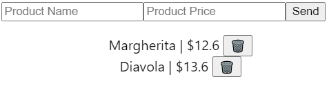

# Welcome to your assesment

The application you are going to build consists of a REST API and a user interface (SPA).

## REST API

The REST API will be implemented using ASP.NET Core.

### Requirements

The only requirement is that all provided functional tests pass successfully without being modified.

## SPA

There are two options for implementing the SPA:

- Angular SPA generated using Angular CLI.

- React SPA generated using CRA.

__Note__: the only difference is that the React SPA already has a form component created, in the Angular SPA this component should be implemented using the framework itself.

### Requirements

- The UI should look like this:



- All CRUD operations should work using the previously built API.

- The product listing should be the same before and after refreshing the browser (F5/Ctrl + F5) without using any local storage.

To start:

- Clone this repo or
- Access the web editor via the following url (requires a GitHub account): gitpod.io/#https://github.com/beasync/blazing-pizza

## Additional notes

Useful commands:

Run API:

```
dotnet run
```

Run API (watch mode):

```
$ src\BlazingPizza.Api > dotnet watch run
```

Test API:

```
dotnet test
```

Useful API imports:

```
using Microsoft.AspNetCore.Mvc;
```